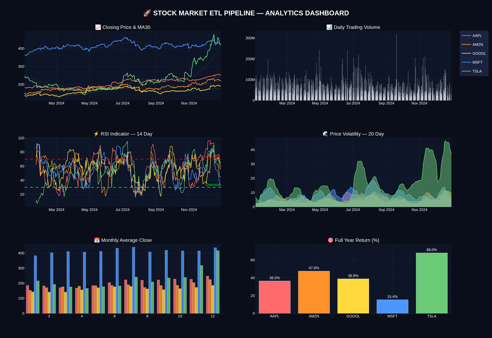

# 🚀 Stock Market ETL Pipeline


> A production-style ETL pipeline extracting live stock market data for AAPL, GOOGL, TSLA, MSFT and AMZN — with automated quality gates, financial feature engineering, anomaly detection and an interactive analytics dashboard.

## 📊 Dashboard Preview


## ⚡ Run It
```bash
git clone https://github.com/YOUR_USERNAME/stock-etl-pipeline.git
cd stock-etl-pipeline
python3 -m venv venv && source venv/bin/activate
pip install -r requirements.txt
python3 run_pipeline.py
```

## 🧠 Features
- Live data extraction from Yahoo Finance API
- Automated 6-point data quality gate
- Feature engineering — MA7, MA30, RSI-14, Volatility, Anomaly Detection
- Colorful terminal UI with rich progress bars
- Interactive Plotly dashboard — HTML + PNG
- SQLite data warehouse with summary analytics view
- Full audit logging

## 👤 Author
Thouna Khaidem — B.E. AI & DS, East Point College of Engineering & Technology, Bangalore
Sreeram M — B.E. AI & DS, East Point College of Engineering & Technology, Bangalore
Nivedhita — B.E. AI & DS, East Point College of Engineering & Technology, Bangalore
Manjunath — B.E. AI & DS, East Point College of Engineering & Technology, Bangalore
